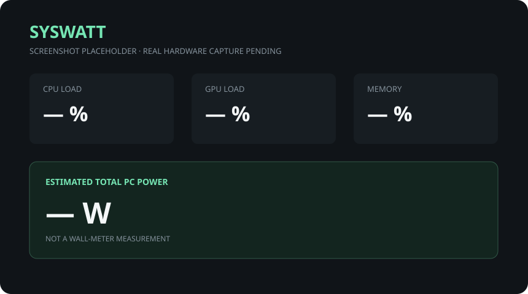

# SysWatt

SysWatt is a lightweight Windows tray utility for live hardware monitoring and honest, configurable PC power estimates. It uses LibreHardwareMonitor for dynamic sensor discovery, keeps five minutes of session history in memory, and runs without permanent administrator privileges.

> **Status:** `0.1.0` pre-release. The architecture and automated domain tests are ready; real-hardware behavior still needs validation across more systems. The Ryzen 5 3600 / RTX 3060 target is an initial manual-test target, not a compatibility claim.



## Features

- Notification-area-first lifecycle with a live numeric tray icon and no taskbar clutter.
- Compact CPU, GPU, memory, storage, fan, measured component power, and modeled power dashboard.
- Bounded five-minute sparklines sampled every second.
- Dynamic, ranked sensor mapping—no hardcoded machine sensor names or indexes.
- Configurable base-system load and PSU efficiency.
- User-defined alerts with metric, operator, threshold, duration, cooldown, severity, toast, and in-app behavior.
- User-scoped, reversible start-with-Windows registration.
- Versioned atomic JSON settings and portable mode.
- JSON diagnostics export with raw sensor metadata and selected normalized mappings.
- No telemetry, accounts, cloud calls, or hardware-data upload.

## Power estimate disclaimer

SysWatt is **not a wall meter**. CPU and GPU values labeled as hardware sensor readings come from the device when available. The app calculates:

```text
Estimated DC load = CPU sensor power + GPU sensor power + configured base system watts
Estimated wall draw = Estimated DC load / configured PSU efficiency
```

Base system watts must represent only unmeasured equipment such as the motherboard, RAM, drives, fans, cooler, and lighting. Do not include CPU or GPU power there when those sensors are available. If either component sensor is missing, the dashboard marks the result as partial/lower confidence.

## Requirements and installation

- Windows 10 version 1809 or newer, or Windows 11, x64.
- Normal user access. Some low-level sensors may be unavailable unless their driver exposes them; SysWatt does not elevate the whole app.

For an installed build, run `SysWatt-Setup-<version>.exe`. The installer is per-user and does not force Windows startup. For the portable ZIP, extract it to a writable folder and run `SysWatt.App.exe`; `portable.flag` keeps settings in the adjacent `data` directory. Remove that flag to use `%LOCALAPPDATA%\SysWatt\settings.json`.

## Usage

- Left-click the tray icon to toggle the dashboard.
- Right-click it for Dashboard, Settings, startup, and Exit.
- Use Settings to select the tray metric, tune the power model, edit alerts, or export a diagnostic JSON report.
- Missing data appears as `N/A`; SysWatt never substitutes a fake zero.

## Build and test

Install the .NET 8 SDK, then run:

```powershell
dotnet restore SysWatt.sln --configfile NuGet.Config
dotnet build SysWatt.sln --no-restore --configuration Release
dotnet test SysWatt.sln --no-build --configuration Release
```

Build release artifacts with:

```powershell
./scripts/package.ps1 -Version 0.1.0
```

Inno Setup 6 is optional locally; when `ISCC.exe` is available the script also creates the per-user installer. The self-contained single-file publish is deliberately untrimmed because hardware libraries and WPF may rely on reflection and native resources.

## Troubleshooting

- **A reading is `N/A`:** the device/driver may not expose a compatible sensor. Export diagnostics from Settings and review the mapping explanation.
- **Tray icon is hidden:** open the Windows tray overflow and pin SysWatt.
- **Power looks low:** a missing CPU/GPU power sensor makes the estimate partial. Adjust base watts only for genuinely unmeasured components.
- **Settings were reset:** malformed JSON is moved to `settings.json.invalid-<timestamp>` before defaults are loaded.
- **A second launch exits:** this is expected; it signals the existing instance to open.

See [architecture](docs/architecture.md), [sensor mapping](docs/sensor-mapping.md), [power and alerts](docs/power-and-alerts.md), and the [manual test checklist](docs/manual-test-checklist.md).

## Contributing and security

Contributions are welcome; start with [CONTRIBUTING.md](CONTRIBUTING.md). Please report security issues privately as described in [SECURITY.md](SECURITY.md). SysWatt is MIT-licensed; dependency notices are in [THIRD-PARTY-NOTICES.md](THIRD-PARTY-NOTICES.md).
