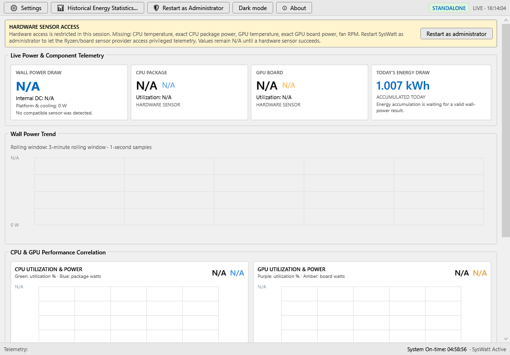
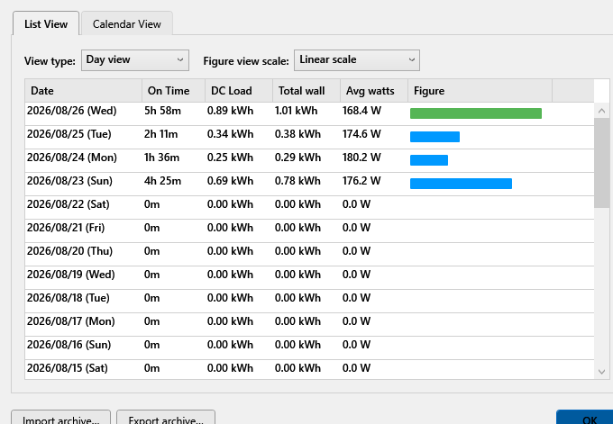
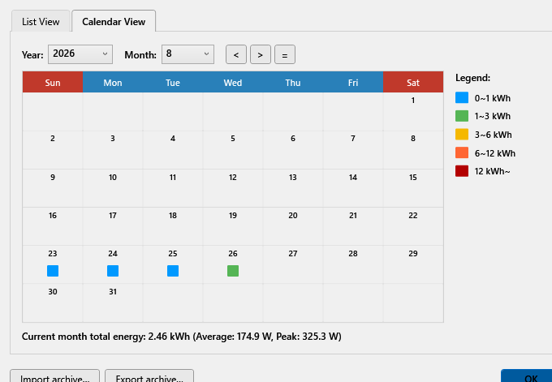
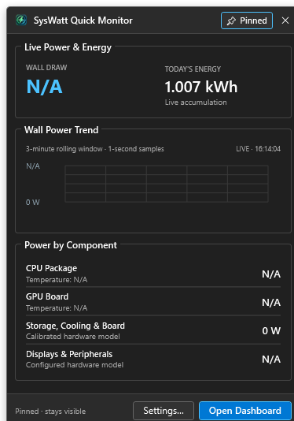
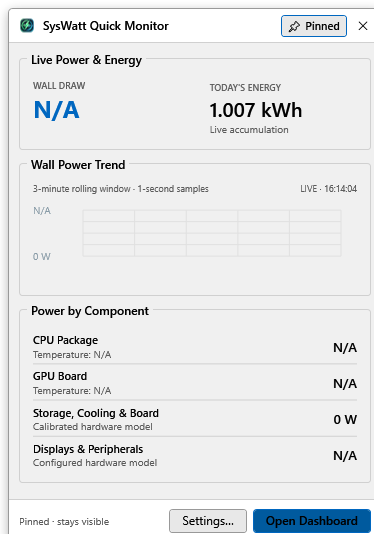
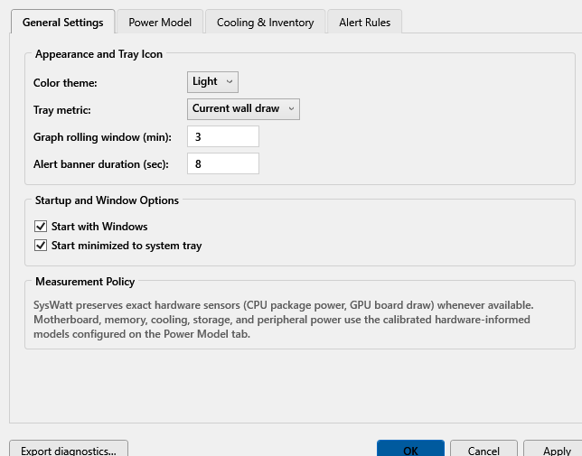
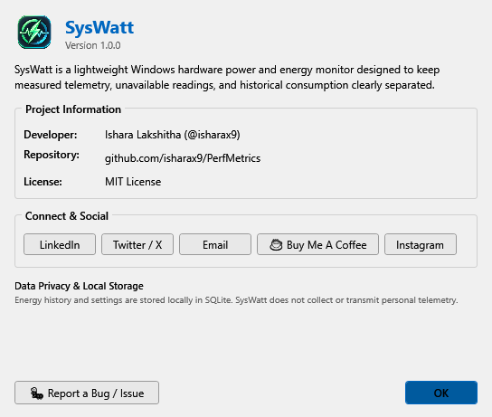

# SysWatt

<div align="center">


### Professional, Lightweight Windows Hardware Power & Energy Monitor

[](https://github.com/isharax9)
[](https://www.linkedin.com/in/isharax9/)
[](https://twitter.com/isharax9)
[](mailto:isharax9@gmail.com)
[](https://www.buymeacoffee.com/macstudyroom)
[](https://www.instagram.com/mac_knight141/)

</div>

---

## Overview

**SysWatt** is a standalone, ultra-low-overhead Windows desktop application for monitoring hardware power consumption, PC run-time, and electrical energy accumulation. Built with native WPF and styled to reflect classic, utilitarian Windows utilities (such as **TrafficMonitor**, **HWiNFO**, and standard Windows Property Sheets), SysWatt delivers rich insights without high CPU or RAM loads.

SysWatt combines embedded sensor access (LibreHardwareMonitor), native Windows activity counters, automated storage and display inventory, and an optional HWiNFO shared-memory bridge.



---

## Key Features

### 🖥️ Windows-Native User Experience
- **Utilitarian Desktop UI**: Clean Windows dialogs, Segoe UI typography, etched GroupBoxes, and DWM-enabled dark/light immersive title bars.
- **Hero Telemetry Overview**: 4 prominent cards displaying **Wall Power Draw**, **CPU Package**, **GPU Board**, and **Today's Energy Draw**, alongside platform DC and cooling breakdowns.
- **Live PC Run-Time / On-Time Counter**: Real-time Windows system boot uptime counter displayed directly in the status bar (`System On-time: 03:42:15 · SysWatt Active`).
- **Synchronized Telemetry Charts**: Professional grid charts with configurable 1–240 minute rolling windows.

### 📊 TrafficMonitor-Style Historical Energy Statistics
Modeled directly after classic Windows utility statistics:
- **List View**:
  - Aggregated by **Day view**, **Week view**, or **Month view**.
  - Columns: **Date**, **On Time** (active PC run time duration), **DC Load**, **Total Wall Draw**, **Average Watts**, and **Figure** inline bar.
  - **Dynamic Scaling**: Toggle between **Linear scale** and a multi-decade **Logarithmic scale** to visualize small and large consumption periods.
- **Calendar Heatmap View**:
  - 7×6 calendar matrix with red weekend headers and colored daily energy indicator tiles.
  - 5-tier consumption color legend (`0~1 kWh`, `1~3 kWh`, `3~6 kWh`, `6~12 kWh`, `12 kWh~`).
  - Monthly summary footer with total kWh, average wattage, and peak recorded load.
  - Full archive **Import** and **Export** capabilities.

| Historical Energy — List View | Historical Energy — Calendar View |
|:---:|:---:|
|  |  |

### 📌 Windows Taskbar Tray Flyout
- Compact taskbar flyout (390 × 550 px) with native drop-shadow elevation.
- Live wall draw, today's energy accumulation, 3-minute rolling trend chart, and component power breakdown.
- Pinnable toggle button (`[ 📌 Pin ]` / `[ 📌 Pinned ]`) and direct shortcut to Settings.

| Tray Dashboard (Dark) | Tray Dashboard (Light) |
|:---:|:---:|
|  |  |

### ⚙️ Tabbed Property Sheet Settings
- Modeled on classic Windows Property Sheets with **[ OK ]**, **[ Cancel ]**, and **[ Apply ]** buttons.
- Tabs: **General Settings**, **Power Model** (custom CPU/GPU envelopes and PSU efficiency), **Cooling & Inventory** (fans, drives, peripherals), and **Alert Rules** (custom threshold rules with toasts and banner alerts).



### ⚡ Low Resource Footprint & Zero-Allocation Steady-State
- **In-Memory SQLite Batch Ingestion**: Replaced 86,400 daily disk transactions with a 60-second / 60-sample in-memory ring buffer batch commit.
- **Zero-Allocation Ring Buffers**: Telemetry time windows are sliced without allocating duplicate arrays each second.
- **Single-Pass Sensor Mapping**: Zero-allocation sensor lookup eliminating LINQ per-tick overhead.
- **Background Idle Suspension**: Telemetry rendering and chart calculations freeze automatically when minimized or hidden.

---

## Screenshots

<details>
<summary><b>Click to view full screenshot gallery</b></summary>

### Live Power Dashboard


### Historical Energy Statistics (List View)


### Historical Energy Statistics (Calendar Heatmap)


### Option Settings Dialog


### Quick Tray Dashboard (Dark & Light)


### About & Developer Profiles Dialog


</details>

---

## Measurement Policy

1. **Exact Sensors**: SysWatt prioritizes exact hardware-reported sensors (CPU package power, GPU board draw, fan RPMs, VRM temperatures) and never overwrites them.
2. **Calibrated Hardware Models**: Storage drives use detected hardware classifications (NVMe, SATA SSD, HDD) plus real-time I/O throughput. Motherboard baseline, RAM, CPU/case cooling, displays, and external peripherals use calibrated models configurable in Settings.
3. **Wall Power Integration**: Wall draw is computed as `PC Internal DC / PSU Efficiency + External Peripherals/Displays`, integrated continuously into daily kilowatt-hours (kWh).
4. **Data Integrity**: Missing hardware sensors appear explicitly as `N/A`—SysWatt never invents artificial zero readings.

---

## Requirements & Building

### System Requirements
- **OS**: Windows 10 (version 1809 or newer) or Windows 11, x64.
- **Framework**: .NET 8.0 Windows Runtime.
- **Hardware Access**: Standard user privileges for Windows Performance counters and GPU metrics. Elevated administrator access or PawnIO driver is needed for direct Ryzen SMU and motherboard Super-I/O sensor headers.

### Building from Source

```powershell
# Restore NuGet dependencies
dotnet restore SysWatt.sln --configfile NuGet.Config

# Build in Release mode
dotnet build SysWatt.sln --configuration Release

# Run automated tests (all 35+ pass)
dotnet test SysWatt.sln --configuration Release
```

### Command Line Flags

| Flag | Description |
|---|---|
| `--minimized` | Start directly minimized to the system notification area. |
| `--diagnose-sensors` | Run a diagnostic hardware scan and output raw sensor metadata. |
| `--smoke-test` | Run an automated headless initialization and exit test. |
| `--preview-dashboard` | Launch the main dashboard in standalone preview mode. |
| `--preview-settings` | Open the Option Settings property sheet dialog. |
| `--preview-energy` | Open the Historical Energy Statistics window. |
| `--preview-tray` | Display the Quick Tray flyout near the notification area. |

---

## Bug Reporting & Feedback

Encountered an issue or have a feature suggestion?
- Click **🐛 Report a Bug / Issue** inside the application's **About** dialog to open the issue tracker with diagnostic details.
- Or open an issue directly on GitHub: [github.com/isharax9/PerfMetrics/issues](https://github.com/isharax9/PerfMetrics/issues/new)

---

## Author & Developer

Developed by **Ishara Lakshitha** ([@isharax9](https://github.com/isharax9)).

Connect:
- **LinkedIn**: [linkedin.com/in/isharax9](https://www.linkedin.com/in/isharax9/)
- **Twitter / X**: [@isharax9](https://twitter.com/isharax9)
- **Email**: [isharax9@gmail.com](mailto:isharax9@gmail.com)
- **Buy Me A Coffee**: [buymeacoffee.com/macstudyroom](https://www.buymeacoffee.com/macstudyroom)
- **Instagram**: [@mac_knight141](https://www.instagram.com/mac_knight141/)
- **GitHub**: [github.com/isharax9](https://github.com/isharax9)

---

## License

This project is licensed under the [MIT License](LICENSE).
